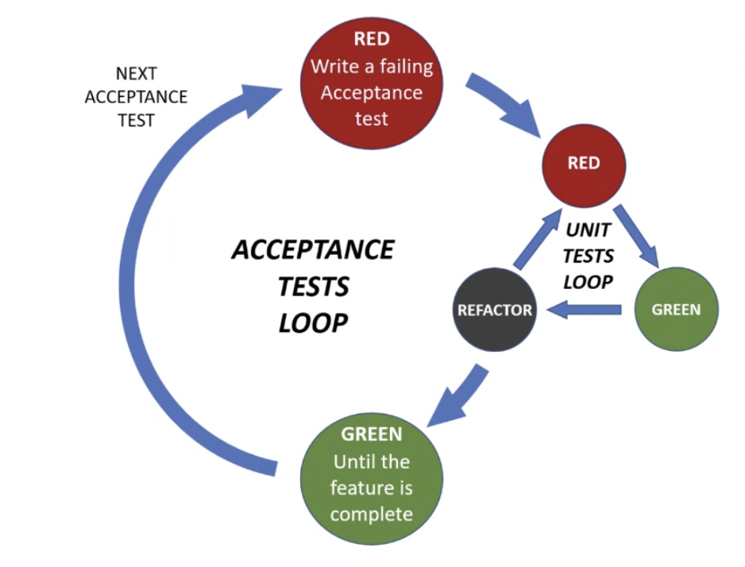

# Artlogic Testing Workshops
## Setup
go to the directory that you want to the workshop to be
```bash
python3 -m venv vevn
source venv/bin/activate
pip install poetry
```

day 1
---
## Agile practices
- scrim & kanbas
- eXtreme Programming
### why do we need them??
pear programing and testing enviroments. addres technical debt (trades off between quality and speed)
### XP practices
#### Feedback practicies
- TDD
- Pair programming
#### Design practices
- Simple design
- Refactoring
### Pair programming
- keep each other on task
- clarify ideas
- Brainstorm
- Lower frustration because of bugg fixing
- hold each other accountable
#### Pair programming roles
##### The navigator and the driver
- Navigator: thinks about the big picture, the next steps, and the overall direction
- Driver: Focuses on the details, writes the code, and keeps the navigator on track
###### Switching roles
- **Chess clock:** roles switch every in a time interval
- **Ping pong:** roles switch every time a test passes
- **Pomodoro:** roles switch in an interval with a brake after
###### Pair rotation
- **Change by task:** roles switch every task
### TDD
The core benefit of TDD:
- **Design:**
Creates a more felixible and maintainable codebase
- **Documetation:**
The test serves as the documentation of the code
- **Debugging:**
Testing work as a debugging tool, help you to find faster the bug
- **Courge:**
You can make changes without fear of breaking the code
#### Three laws of TDD
1. write a failing test
2. write the minimum amount of code to make the test pass
3. refactor the code
#### Baby steps
1. **Fake implementation:**
Hardcode the return value
2. **Obvious implementation:**
When you know the code you want to write
3. **Triangulation:**
Generalize behavior

##### Notes
* Assertions are what make a test a test
* just code for the test you are writing

## Exercise
1. Write a function that takes numbers from 1 to 100 and outputs them as a string, but for multiples of three returns “Fizz” instead of the number and for the multiples of five returns “Buzz”. For numbers which are multiples of both three and five returns “FizzBuzz”.

To start the excercice create a new poetry project:
```bash
poetry new <project name>
cd <project name>
poetry add pytest
```

2. Leap year kata
Write a function that returns true or false depending on whether its input integer is a leap year or not.
A leap year is defined as one that is divisible by 4, but is not otherwise divisible by 100 unless it is also divisible by 400.
For example, 2001 is a typical common year and 1996 is a typical leap year, whereas 1901 is an atypical common year and 2000 is an atypical leap year.

To start the excercice create a new poetry project:
```bash
poetry new <project name>
cd <project name>
poetry add pytest
```

### Solution
1. 
[fizzbuzz.py](./fizzbuzz/fizzbuzz/fizzbuzz.py)
```python
class FizzBuzz:
    def number_conversion_to_string(self, number: int) -> str:
        if number < 0 or number > 100:
            return "Out of range"
        if number % 3 == 0 and number % 5 == 0:
            return "FizzBuzz"
        if number % 3 == 0:
            return "Fizz"
        if number % 5 == 0:
            return "Buzz"
        return str(number)
```
[test_fizzbuzz.py](./fizzbuzz/tests/test_fizzbuzz.py)
```python
from fizzbuzz.fizzbuzz import FizzBuzz
from parameterized import parameterized

class TestFizzBuzz:
    @parameterized.expand(
        [
            (1, "1"),
            (2, "2"),
            (3, "Fizz"),
            (4, "4"),
            (5, "Buzz"),
            (15, "FizzBuzz"),
        ]
    )
    def test_fizzbuzz(self, number, output) -> None:
        assert FizzBuzz().number_conversion_to_string(number) == output
```
2.
[leap_year.py](./leap_year/leap_year/leap_year.py)
```python
class LeapYearCalculator:
    def is_leap_year(self, year: int) -> bool:
        if year % 400 == 0:
            return True
        if year % 100 == 0:
            return False
        if year % 4 == 0:
            return True
        return False
```
[test_leap_year.py](./leap_year/tests/test_leap_year.py)
```python
from parameterized import parameterized

from leap_year_kata.leap_year_kata import LeapYearCalculator


class TestLeapYearCalculator:
    @parameterized.expand(
        [
            (2001, False), 
            (1996, True), 
            (1900, False), 
            (2000, True)
        ]
    )
    def test_is_leap_year(self, year, is_leap) -> None:
        assert LeapYearCalculator().is_leap_year(year) == is_leap
```
---

day 2
---
## Excercice
1.

Instructions:

A squad of robotic rovers are to be landed by NASA on a plateau on Mars.

This plateau, which is curiously rectangular, must be navigated by the rovers so that their onboard cameras can get a complete view of the surrounding terrain to send back to Earth.

Your task is to develop an API that moves the rovers around on the plateau.

In this API, the plateau is represented as a 10x10 grid, and a rover has state consisting of two parts:

its position on the grid (represented by an X,Y coordinate pair)
the direction the compass is facing (represented by a letter, one of  'N', 'S', 'E', 'W')
the starting position of the rover is '0:0:N'
Input

The input to the program is a string of one-character move commands:

'L' and 'R' rotate the direction the rover is facing
'M' moves the rover one grid square forward in the direction it is currently facing.
If a rover reaches the end of the plateau, it wraps around the end of the grid.

Output

The program's output is the final position of the rover after all the move commands have been executed. The position is represented as a coordinate pair and a direction, joined by colons to form a string. For example: a rover whose position is `2:3:W` is at square (2,3), facing west.

Examples
given an input 'MMRMMLM' then the output should be '2:3:N'
given an input 'MMMMMMMMMM' gives output '0:0:N' (due to wrap-around)


MarsRoverAnimation
 Interface

There are no restrictions on the design of the public interface.

A public interface to the API could look something like this:

 public class MarsRover
  {
     public string Execute(string command);
  }


Rules:
The rover receives a char array of commands e.g.'RMMLM' and returns the finishing point after the moves e.g. '2:1:N'
The rover wraps around if it reaches the end of the grid.

```bash
poetry new mars_rover
poetry add pytest
```

### Solution
[mars_rover.py](./mars_rover/mars_rover/mars_rover.py)
```python
class MarsRover:
    def execute(self, command: str) -> str:
        x = 0
        y = 0
        c_points = ["N", "E", "S", "W"]
        index = 0

        for instruction in command:
            if instruction == "R":
                # if index < 3:
                index += 1
                if index > 3:
                    index = 0
            if instruction == "L":
                index -= 1
                if index < 0:
                    index = 3
            if instruction == "M":
                if c_points[index] == "N":
                    y += 1
                if c_points[index] == "S":
                    y -= 1
                if c_points[index] == "W":
                    x -= 1
                if c_points[index] == "E":
                    x += 1
            if x > 9:
                x = 0
            if y > 9:
                y = 0

        cardinal = c_points[index]

        return "{}:{}:{}".format(x, y, cardinal)
```

[test_mars_rover.py](./mars_rover/tests/test_mars_rover.py)
```python
import pytest

from mars_rover.mars_rover import MarsRover


class TestMarsRover:
    @pytest.mark.parametrize(
        "command, location",
        [
            ("", "0:0:N"),
            ("R", "0:0:E"),
            ("RR", "0:0:S"),
            ("RRR", "0:0:W"),
            ("RRRR", "0:0:N"),
            ("L", "0:0:W"),
            ("LL", "0:0:S"),
            ("LLL", "0:0:E"),
            ("LLLL", "0:0:N"),
            ("M", "0:1:N"),
            ("MM", "0:2:N"),
            ("MMRMMLM", "2:3:N"),
            ("MMMMMMMMMM", "0:0:N"),
        ],
    )
    def test_rotations(self, command: str, location: str) -> None:
        assert MarsRover().execute(command) == location
```

## Elements of simple desing

- **Passes all of its tests**
- **Minimizes duplications**
- **Maxmizes clarity**
- **Has fewer elements**

## Outside-in Development

This idea is more business view.
given-when-where

### Double loop TDD

The acepten test is more domain driven. 




## Excercice

[execice link](https://www.codurance.com/katas/shopping-cart-kata)

### Soulution (INCOMPLETE)
[shopping_cart.py](./shopping_cart/shopping_cart/shopping_cart.py)
```python
class Product:
    def __init__(self, product_name, cost, revenue, VAT):
        self.product_name = product_name
        self.cost = cost
        self.revenue = revenue
        self.VAT = VAT

class ProductDatabse:
    def get_all():
        pass

class DiscountService:
    def get_discount():
        pass

class ShoppingCart:
    def __init__(self, products_database: ProductDatabse, discount_service: DiscountService = DiscountService):
        self.products_database = products_database
        self.discount_service = discount_service

    def print_cart(self):
        total_products = len(self.products_database.get_all())
        discount = self.products_database.apply_discount()
        if total_products == 0:
            return {'total_products': 0, 'total_price': 0}

        total_price = 0
        products = self.products_database.get_all()
        for product in products:
            ## ROUNDIND IS NOT ROUNDING UP
            VAT = round(product.VAT * product.cost,2)
            revenue = round(product.revenue * product.cost,2)
            ## TOTAL PRICE IS OF BECAUSE OF ROUNDIND
            total_price += product.cost + VAT + revenue
        discount = self.discount_service.get_discount()
        if discount:
            total_price = round(total_price-(total_price*discount), 2)
        
        return {'total_products': total_products, 'total_price': total_price}    
```

[test_shoping_cart.py](./shopping_cart/tests/test_shopping_cart.py)
```python
import pytest
from unittest.mock import MagicMock
from shopping_cart.shopping_cart import ShoppingCart, Product


class TestShoppingCart:
    def test_empty_cart(self):
        product_database = MagicMock()
        product_database.get_all.return_value = []
        shopping_cart = ShoppingCart(product_database)
        assert shopping_cart.print_cart() == {'total_products': 0, 'total_price': 0}

    def test_iceberg(self):
        product_database = MagicMock()
        product_database.get_all.return_value = [Product(product_name = 'Iceberg', cost=1.55, revenue=0.15, VAT=0.21)]
        shopping_cart = ShoppingCart(product_database)
        assert shopping_cart.print_cart() == {'total_products': 1, 'total_price': 2.17}

    def test_multiple_products(self):
        product_database = MagicMock()
        product_database.get_all.return_value = [
            Product(product_name = 'Iceberg', cost=1.55, revenue=0.15, VAT=0.21), 
            Product(product_name='Tomato', cost=0.52,revenue=0.15, VAT=0.21), 
            Product(product_name='Chicken', cost=1.34,revenue=0.12, VAT=0.21)
        ]
        shopping_cart = ShoppingCart(product_database)
        assert shopping_cart.print_cart() == {'total_products': 3, 'total_price': 4.73}
    
    def test_discount(self):
        product_database = MagicMock()
        product_database.get_all.return_value = [Product(product_name = 'Iceberg', cost=1.55, revenue=0.15, VAT=0.21)]
        discount_service = MagicMock()
        discount_service.get_discount.return_value = 0.05
        shopping_cart = ShoppingCart(product_database, discount_service= discount_service)
        assert shopping_cart.print_cart() == {'total_products': 1, 'total_price': 2.06}
```


 
